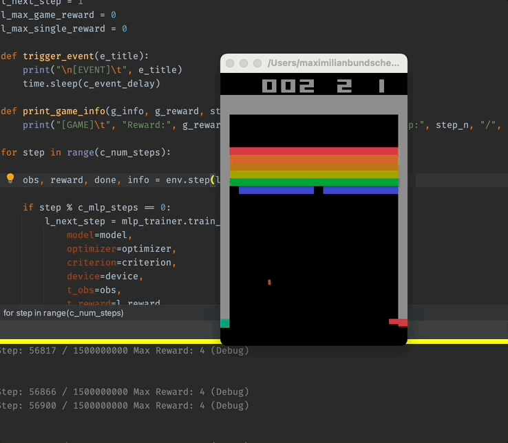
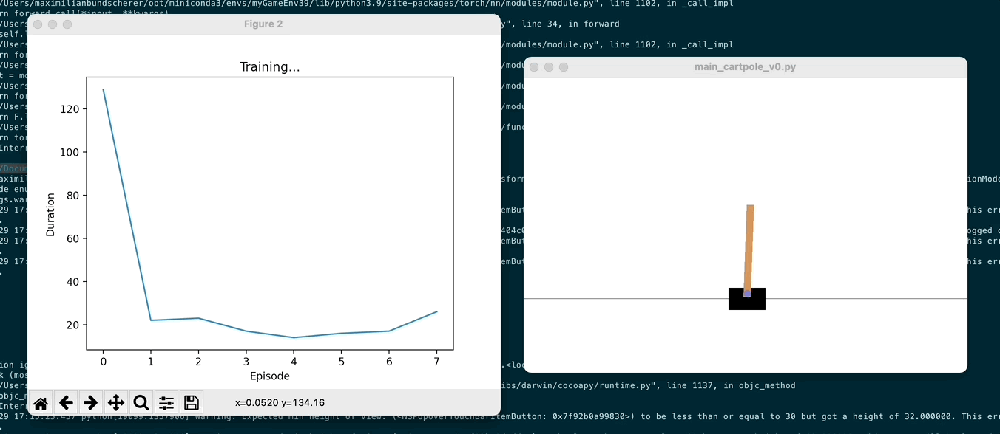

# ML Game

Just another approach to do machine learning stuff on games.

``python - machine learning - games``

Author: [Maximilian Bundscherer](https://bundscherer-online.de)

## Overview

*Included Breakout sample*

*Included CartPole sample*

### Features

- Testing reinforcement learning algorithms with python and [gym](https://gym.openai.com/)
- Game [Breakout-v0](https://gym.openai.com/envs/Breakout-v0/) included
- Game [CartPole-v0](https://gym.openai.com/envs/CartPole-v0/) included
- PyTorch implementation included

### Requirements

- Python (pip requirements included) (3.9 recommend)

### Let's get started

- Create virtual python env
- Install requirements (see script in ``python/``)
- Run python scripts (see script in ``python/src``)
